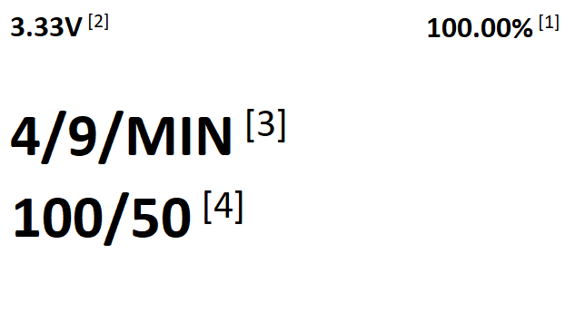
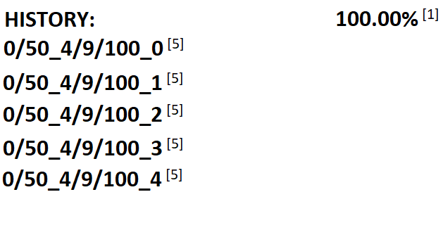
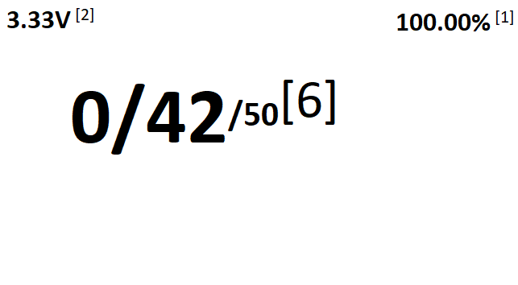
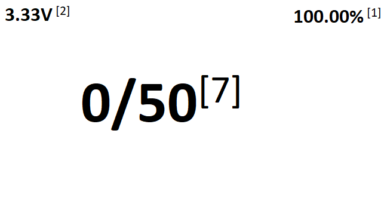

# MadLEDs
- MadLEDs is an observation game for the **esp32 board** write in C++.
- This game is simple, one of the three LEDs lights up and you "catch" it by pressing the corresponding button. If you make it before the other LED is illuminated so you will be added a point if not, so you have no point. The time delay between LED switching can be set at the beginning of the game after the opening animation.
- With OLED display and battery status and with simple goal and that is: **FUN :)**
### [Documentation and instructions](https://pchelium.github.io/)

> [!WARNING]
>The author accepts no liability for damages resulting from the use of this code or other parts contained in this project and on the website of project!

## Components for building
- **some esp32 board**
- **0.96" 128x64 OLED display, I2C**
- **Fuel Gauge MAX17048 battery sensor** (this is not necessary, but is recommended). You can use any MAX1704x supported library listed in the library section, but you must modify the code before using it.
- **6 buttons**
- **3 LEDs and resistors for LEDs**(you have to calculate the value of the resistor...)
- **And many cables...**
## Libraries
- [Adafruit_SSD1306](https://github.com/adafruit/Adafruit_SSD1306) for display.
- [SparkFun_MAX1704x_Fuel_Gauge_Arduino_Library](https://github.com/sparkfun/SparkFun_MAX1704x_Fuel_Gauge_Arduino_Library) for MAX17048 battery sensor.
## Overview of the user environment

- **Home screen:** 

- **History screen:** 

- **Game progress screen:** 

- **Game end screen** (this screen is followed by the home screen): 

\[1] - Battery percentage  
\[2] - Battery voltage  
\[3] - **4** is min value, **9** is max value, **MIN** is a variable in the following order (**MIN, TAR, MAX, RES**)   
\[4] - **100**  is resolution(RES), **50** is target(TAR)  
\[5] - **0** is number of correct answers, **50** is maximum number of points(one correct = one point)  
&nbsp;&nbsp;&nbsp;&nbsp;&nbsp;- **4** is min value, **9** is max value, **100** is resolution  
&nbsp;&nbsp;&nbsp;&nbsp;&nbsp;- The last number after *_* is the user identification number  
\[6] - **0** is number of correct answers, **42** is number to finish, **50** is maximum number of points  
\[7] - **0** is number of correct answers, **50** is maximum number of points  
## Contribution
- If you have any ideas on how to improve this game, add new features, or just anything.... Then leave a comment on this project so that more people don't work on the same thing :). And then contribute your code.
- Or you can leave a comment and I will try to process your request(or suggestion for improvement) :slightly_smiling_face:.
